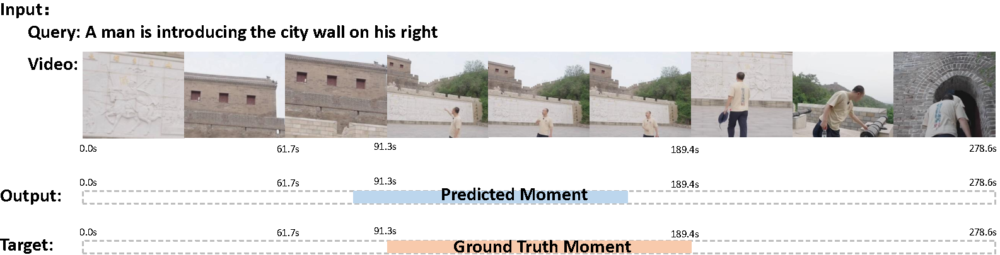
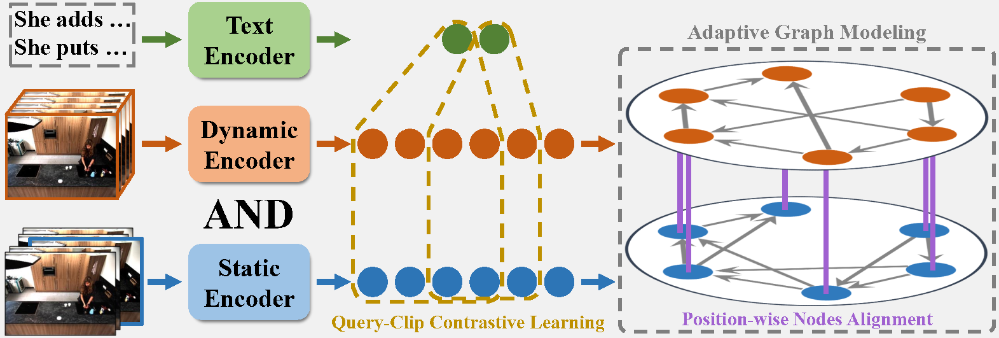

# Static and Dynamic Graph Alignment Network for Temporal Video Grounding

<p align="center">
  <a href="./README.md"></a>
  <a href="./README_zh.md"></a>
</p>


<summary><b>📕 Table of Contents</b></summary>

- [Task Definition](#task-definition)
- [Innovation](#innovation)
- [Data Preparation](./data_preparation/data_preparation_README.md)
- [Environment Setting](./environment/env_README.md)
- [Project Structure](#project_structure)
- [Main Results](#main-results)
- [More Information](#more-information)


## Task Definition

Temporal Video Grounding (TVG) also known as: Temporal sentence grounding in videos (TSGV), natural language video localization (NLVL), video moment retrieval (VMR).

The objective of **Temporal Video Grounding (TVG)** is to
localize the precise moment in an untrimmed video that
corresponds to given language queries.



## Innovation



The figure above provides a simple illustration of the proposed **Static and Dynamic Graph Alignment Network (SDGAN)**. The model introduces two key innovations:

- **Effective exploitation of both static and dynamic visual features**:  
  Unlike existing methods that typically rely on either static or dynamic visual features alone, SDGAN successfully integrates both. It employs several techniques — including **Position-wise Nodes Alignment** (as shown in the figure) — to effectively exploit and mitigate the semantic discrepancy between static and dynamic features. 

- **Query-aware video feature construction**:  
  GCN-based approaches construct temporal graphs in a query-agnostic manner, where video features interact according to predefined rules without guidance from the video content or the specific query.  
  To address this limitation, SDGAN introduces **Query–Clip Contrastive Learning** and **Adaptive Graph Modeling** (illustrated in the figure). This query-aware approach produces more discriminative node representations, leading to stronger temporal graph modeling.


The detailed mechanisms are presented in the paper.
## Project Structure
```plaintext
MAIN_CODE/
├── test1.py                    # Inference entry, supports CLI configuration
├── train1.py                   # Training entry, supports CLI configuration
├── UTiLs/                      # General utilities and helper scripts
│     └─ CheckParameters/                    
│           └── PrintObj.py     # Utility: print detailed data structure info
├── dataset/                    # Annotation and label files for datasets
├── configs/                    # Configuration files for various datasets
│   └── config_baby.yaml        # Debug dataset template with comprehensive comments
├── good_testing/               # Auxiliary test scripts for the project
├── data/                       # Root directory for datasets and features
│   └── baby/                   # Example debug dataset (baby)
│       ├── frame_feature/      # Static visual features
│       ├── i3d_features.hdf5   # Dynamic I3D video features
│       └── text_feature/       # Text query features
└── model_all/                  # Main model module
    ├── engine/                 # Training/inference flow control
    │   └── StageManager.py     # Utility: Training stage scheduler and manager
    ├── modeling/               # Core model definitions
    │   ├── Movie.py            # Video feature management class
    │   └── main_model.py       # SDGAN model main implementation
    ├── data/                   # Data loading and preprocessing
                                # Bridge design pattern: unifies access to multiple datasets and modalities
    └── subassembly/            # Model sub-components and basic modules
```

### Training
```bash
python train1.py \
  --config-file configs/config_baby.yaml \
  --device cuda:7 \
  --tag train_test
```
### Testing
```bash
python test1.py \
  --config-file checkpoints/train_test/config.yml \ # Use the expanded config generated during training
  --ckpt checkpoints/train_test/model_30e.pth \
  --device cuda:6
```

## Main Results
We compare the proposed SDGAN with state-of-the-art methods on three widely used TVG benchmark datasets, as summarized in the following Table. 
Overall, SDGAN achieved the best performance on the vast majority of evaluation metrics.
The results of [UniSDNet*](https://github.com/xian-sh/UniSDNet) were reproduced using its publicly available source code.

## More Information

### Acknowledgements
This code is inspired by [UniSDNet](https://github.com/xian-sh/UniSDNet), [ReLoCLNet](https://github.com/26hzhang/ReLoCLNet) [OSGNet](https://github.com/Yisen-Feng/OSGNet). We thank the authors for their awesome open-source contributions.

### Contact
If there are any questions, feel free to open an issue or contact the author: Zhanjie Hu (ZhanJieHu@163.com)