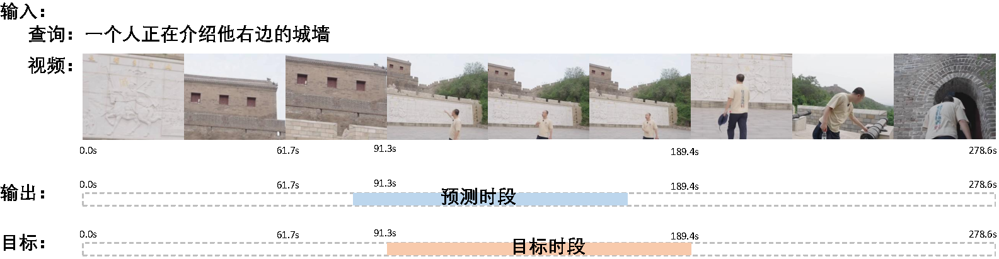
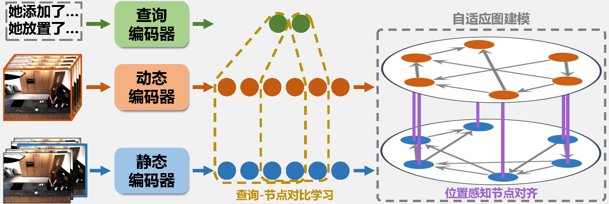

# Static and Dynamic Graph Alignment Network for Temporal Video Grounding

  
  

<!-- ##### [Arxiv](https://arxiv.org/abs/2403.14174)？？   -->
   
<!-- ##### [IEEE Trans. PAMI](https://ieeexplore.ieee.org/document/10955430)？？   -->

<!-- 语法：[标题文字](文件相对路径#锚点名称)   -->

<b>📕 目录</b>

- [任务定义](#任务定义)
- [创新点](#创新点)
- [数据准备](./data_preparation/data_preparation_README_zh.md)
- [环境配置](./environment/env_README_zh.md)
- [训练](#训练)
- [推理](#推理)
- [主要结果](#主要结果)
- [更多信息](#更多信息)

## 任务定义
**视频时段定位**任务的目标是在未剪辑视频中根据给定语言查询相找到对应的精确时段。

## 创新点

上图为提出的**静态与动态图对齐网络（SDGAN）**的简要示意图。该模型主要有以下两大创新：

- **有效融合静态与动态视觉特征**：  
  现有方法通常仅依赖静态或动态视觉特征中的一种，而SDGAN成功地将两者进行整合。它采用多种技术（包括图中所示的**位置感知节点对齐**）来有效挖掘并缓解静态与动态视觉特征之间的语义差异。

- **查询感知的视频特征构建**：  
  传统方法在构建时序图时通常采用查询无关（query-agnostic）的方式，视频特征仅按照预定义规则进行交互，缺乏视频内容和查询的引导。  
  为解决这一问题，SDGAN提出了**查询-节点对比学习**和**自适应图建模**（如图所示）。这种查询感知的视频特征构建方式能够生成更具区分性的节点表示，从而显著提升时序图建模的效果。

具体机制详见论文。
## 训练

## 推理

## 主要结果

## 更多信息

### 致谢
本代码受 [UniSDNet](https://github.com/xian-sh/UniSDNet), [ReLoCLNet](https://github.com/26hzhang/ReLoCLNet) [OSGNet](https://github.com/Yisen-Feng/OSGNet) 启发。在此感谢原作者们出色的开源贡献。

### 联系作者
如果有任何问题，欢迎提交issue或者联系作者：胡战捷（ZhanJieHu@163.com）