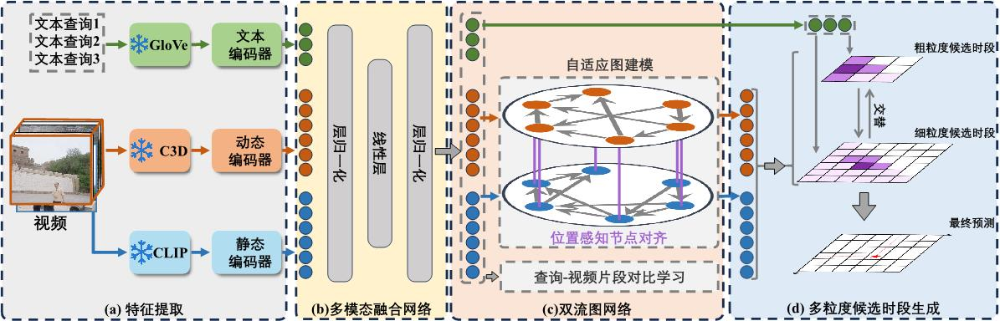
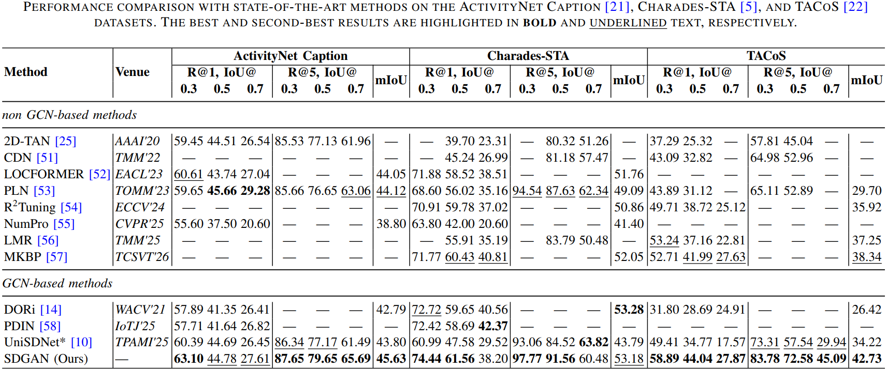

# Static and Dynamic Graph Alignment Network for Temporal Video Grounding


> 胡战捷, 张博麟, 王建华, 郑剑波, 严晨宸, Takahiro Komamizu, Ichiro Ide, 钱江波
  
##### [Arxiv](https://arxiv.org/abs/2605.00684)   

##### [补充材料](https://arxiv.org/src/2605.00684v1/anc/Supplementary_Material.pdf)

##### [小红书](https://www.xiaohongshu.com/discovery/item/69f4061c0000000020039ab2?source=webshare&xhsshare=pc_web&xsec_token=LB2emC5KOcHQF3q_T1-PqerxqwGNzvrzDARYeBTn3uqF4=&xsec_source=pc_share)

<p align="center">
  <a href="./README.md"></a>
  <a href="./README_zh.md"></a>
</p>


<!-- ##### [Arxiv](https://arxiv.org/abs/2403.14174)？？   -->
   
<!-- ##### [IEEE Trans. PAMI](https://ieeexplore.ieee.org/document/10955430)？？   -->


<!-- 语法：[标题文字](文件相对路径#锚点名称)   -->
<summary><b>📕 目录</b></summary>

- [任务定义](#任务定义)
- [创新点](#创新点)
- [数据准备](./data_preparation/data_preparation_README_zh.md)
- [环境配置](./environment/env_README_zh.md)
- [文件与目录说明](#文件与目录说明)
- [主要结果](#主要结果)
- [更多信息](#更多信息)

## 任务定义
**视频时段定位**任务的目标是在未剪辑视频中根据给定语言查询相找到对应的精确时段。


## 模型架构



上图为提出的**静态与动态图对齐网络SDGAN**的示意图。该模型主要有以下三大创新：

- **有效融合静态与动态视觉特征**：  
  现有方法通常仅依赖静态或动态视觉特征中的一种，而SDGAN成功地将两者进行整合。它采用多种技术（包括图中所示的**位置感知节点对齐**）来有效挖掘并缓解静态与动态视觉特征之间的语义差异。

- **查询感知的视频特征构建**：  
  传统方法在构建时序图时通常采用查询无关（query-agnostic）的方式，视频特征仅按照预定义规则进行交互，缺乏视频内容和查询的引导。  
  为解决这一问题，SDGAN提出了**查询-视频片段对比学习**和**自适应图建模**（如图所示）。这种查询感知的视频特征构建方式能够生成更具区分性的节点表示，从而显著提升时序图建模的效果。

- **渐进式由易到难训练策略**： 
  现有时序视频定位方法多依赖单粒度候选框建模，缺少由易到难的渐进式训练范式，易出现训练不稳定、鲁棒性弱、定位精度有限等问题。本文借鉴课程学习思想，提出渐进式由易到难训练策略 PEHT，融合粗粒度语义定位与细粒度时序边界优化。训练过程跨轮次交替双分支优化：前期侧重粗粒度语义匹配，快速锁定相关时序区间；后期精细化微调时序边界，逐级提升视频时序定位的准确性与模型泛化能力。

具体机制详见论文。

## 文件与目录说明
```plaintext
MAIN_CODE/
├── test1.py                    # 推理入口，可在此配置参数
├── train1.py                   # 训练入口，可在此配置参数
├── UTiLs/                      # 通用工具函数与辅助脚本
│     └─ CheckParameters/                    
│           └── PrintObj.py     # 工具类：用于打印复杂数据结构详情
├── dataset/                    # 各数据集标注与标签文件
├── configs/                    # 数据集相关配置文件
│   └── config_baby.yaml        # 示例调试数据集配置，含详细注释
├── good_testing/               # 项目辅助测试脚本
├── data/                       # 数据集根目录
│   └── baby/                   # 示例调试数据集（baby）
│       ├── frame_feature/      # 静态视觉特征
│       ├── i3d_features.hdf5   # 动态 I3D 视频特征
│       └── text_feature/       # 文本查询特征
└── model_all/                  # 模型主体模块
    ├── engine/                 # 训练/推理流程控制
    │   └── StageManager.py     # 工具：训练阶段调度与管理
    ├── modeling/               # 核心模型定义
    │   ├── Movie.py            # 视频特征管理类
    │   └── main_model.py       # SDGAN 模型主体实现
    ├── data/                   # 数据加载与预处理模块
                                # 采用桥接模式设计：统一兼容多数据集与多模态数据
    └── subassembly/            # 模型子组件与基础模块
```

### 训练
```bash
python train1.py \
  --config-file configs/config_baby.yaml \
  --device cuda:7 \
  --tag train_test
```
### 推理
```bash
python test1.py \
  --config-file checkpoints/train_test/config.yml \ # 使用训练后保存的展开配置
  --ckpt checkpoints/train_test/model_30e.pth \
  --device cuda:6
```

## 主要结果
我们在三个广泛使用的视频时序定位（TVG）基准数据集上，将本文提出的 SDGAN 与当前最优方法进行了对比，结果汇总于下表。
总体而言，SDGAN 在绝大多数评价指标上均取得了最优性能。[UniSDNet*](https://github.com/xian-sh/UniSDNet) 的结果系采用其公开源代码复现得到。



## 更多信息

### 致谢
本代码受 [UniSDNet](https://github.com/xian-sh/UniSDNet), [ReLoCLNet](https://github.com/26hzhang/ReLoCLNet) [OSGNet](https://github.com/Yisen-Feng/OSGNet) 启发。在此感谢原作者们出色的开源贡献。

### 联系作者
如果有任何问题，欢迎提交issue或者联系作者：胡战捷（ZhanJieHu@163.com）